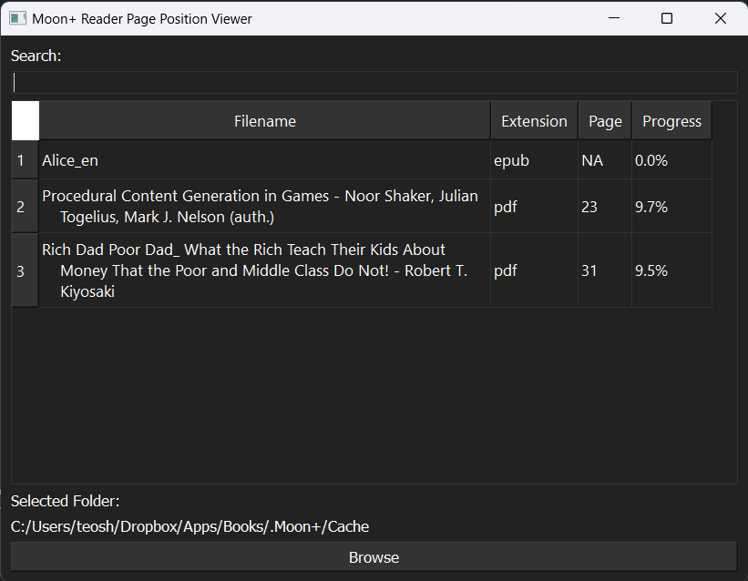

# Moon+ Reader Page Number Viewer
Moon+ Reader's sync page position feature only supports syncing on mobile devices, leaving desktop users without access to this information. However, this quick and simple desktop viewer app has been created to address this issue. While the code for the app is messy, as it was written in just two hours and works as intended. Although the code may benefit from refactoring but I don't care, the app is currently functional and provides a solution for accessing page position information on desktop devices. Additionally sort and search are available for people who have tons of books.

# How To Use
Select the locally synced folder on your pc and select the folder that contains all `.op` files generated by Moon+ Reader. This will be a one time setup as it will remember the path for you. If there's any error check debug.log at the same root directory of the executable file. 